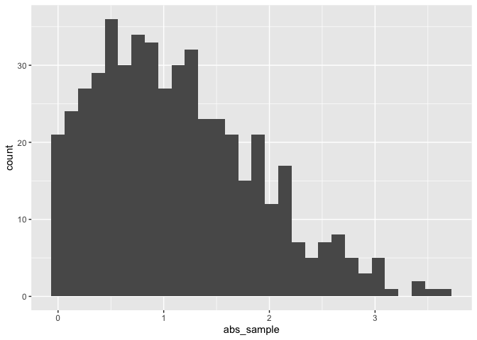

Simple document
================
Tanya Butt
September 16th, 2021

I’m an R Markdown document!

# Section 1

Here’s a **code chunk** that samples from a *normal distribution*:

``` r
samp = rnorm(100)
length(samp)
```

    ## [1] 100

# Section 2

I can take the mean of the sample, too! The mean is -0.0466266.

\#Section 3 Let’s write a new code chunk.

This code chunk imports the stuff from last lecture. These do different
things to the code chunk below: echo = FALSE collapse = TRUE eval =
FALSE message = FALSE removes tidyverse import warnings

``` r
library(tidyverse)

## set seed to ensure reproducibility
set.seed(1234)

## define data frame containing x and y
plot_df = tibble(
  x = rnorm(1000, sd = .5),
  y = 1 + 2 * x + rnorm(1000)
)

## histogram of x
ggplot(plot_df, aes(x = x)) + geom_histogram()
```

<!-- -->

``` r
## scatterplot of x and y
ggplot(plot_df, aes(x = x, y = y)) + geom_point()
```

<!-- -->

``` r
library(tidyverse)

## set seed to ensure reproducibility
set.seed(12)

## define data frame containing x and y
learning_df = tibble(
  sample = rnorm(500, mean = 1),
  sample_pos = sample > 0,
  abs_sample = abs(sample)
)

## histogram of x
ggplot(learning_df, aes(x = abs_sample)) + geom_histogram()
```

<!-- -->

``` r
##median value of x
median_samp = median(pull(learning_df,sample))
```

The median of the variable containing absolute values is 0.97.
